# iPod Hi-Fi Grille Replacement

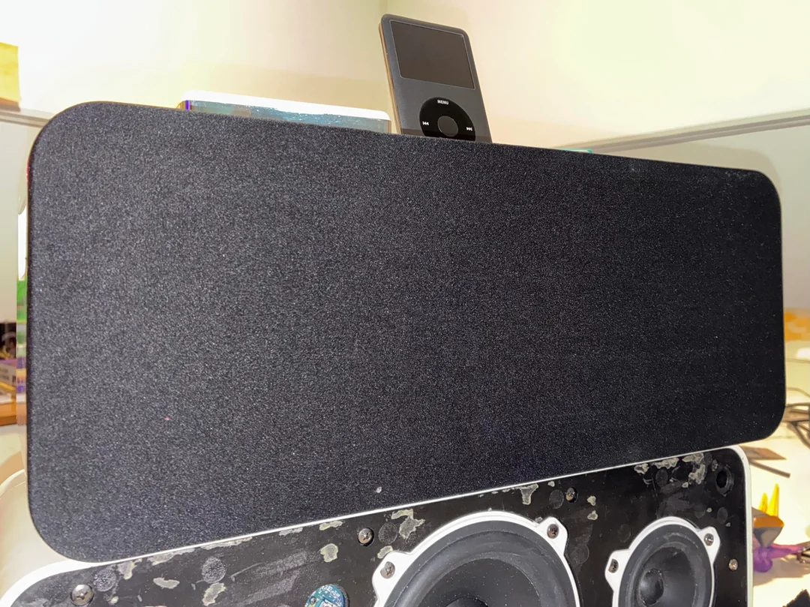

A 3D-printable replacement front grille frame for the **Apple iPod Hi-Fi A1121**, designed to be covered with fabric and mounted using replaceable screw-in pegs.

This project is meant for iPod Hi-Fi units with a missing or damaged original front grille. The replacement uses a printed support frame hidden behind fabric, so the visible front remains a clean fabric panel rather than a plastic printed mesh.

This is an independent repair/restoration project. It is not an original Apple part and is not affiliated with or endorsed by Apple.

---

## Quick Links

- [What this is](#what-this-is)
- [Files included](#files-included)
- [Parts overview](#parts-overview)
- [Materials](#materials)
- [Print settings](#print-settings)
- [Assembly](#assembly)
- [Fabric installation](#fabric-installation)
- [Mounting pegs](#mounting-pegs)
- [Known notes](#known-notes)
- [Development log](DEVELOPMENT.md)
- [Credits](#credits)
- [License](#license)

---

## What This Is

This is a replacement front grille assembly for the Apple iPod Hi-Fi.

The design is made from:

- three main printed frame sections;
- replaceable screw-in mounting pegs;
- glued fabric retaining strips;
- an optional assembly support to help align the frame sections during gluing;
- fabric stretched over the printed frame.

The printed frame is designed to sit behind the fabric. The fabric is the visible surface.

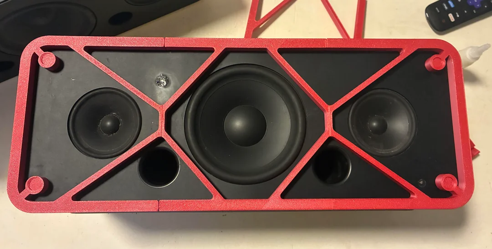

---

## Files Included

The repository includes:

- a Fusion 360 source file;
- OBJ exports for the printable parts;
- documentation photos in the `Pictures/` folder;
- this README;
- a separate development log in [`DEVELOPMENT.md`](DEVELOPMENT.md).

The OBJ files are intended to include the main grille frame sections, replaceable pegs, retaining strips, and optional assembly support.

---

## Parts Overview

### Main Frame

The grille frame is split into three main parts so it can fit on a small 3D printer, including the Bambu Lab A1 Mini.

### Assembly Support

An optional assembly support is included to help align the frame sections during gluing. It is not part of the final visible grille.

Use of the assembly support is optional, but recommended.

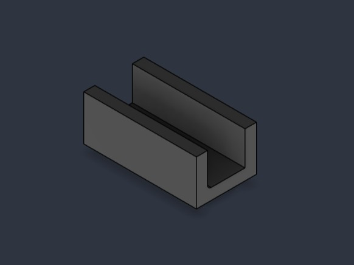

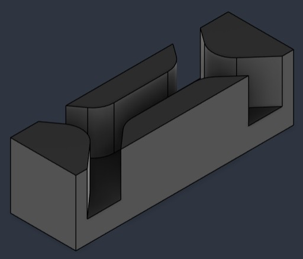

### Retaining Strips

The retaining strips are used to hold the fabric in the fabric retention channel. They are glued in place after the fabric is stretched over the frame.

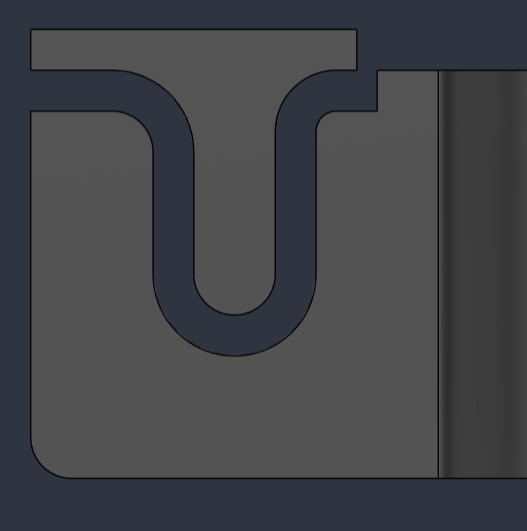

### Replaceable Pegs

The mounting pegs are separate screw-in parts. This allows the peg design to be changed later without reprinting the full frame.

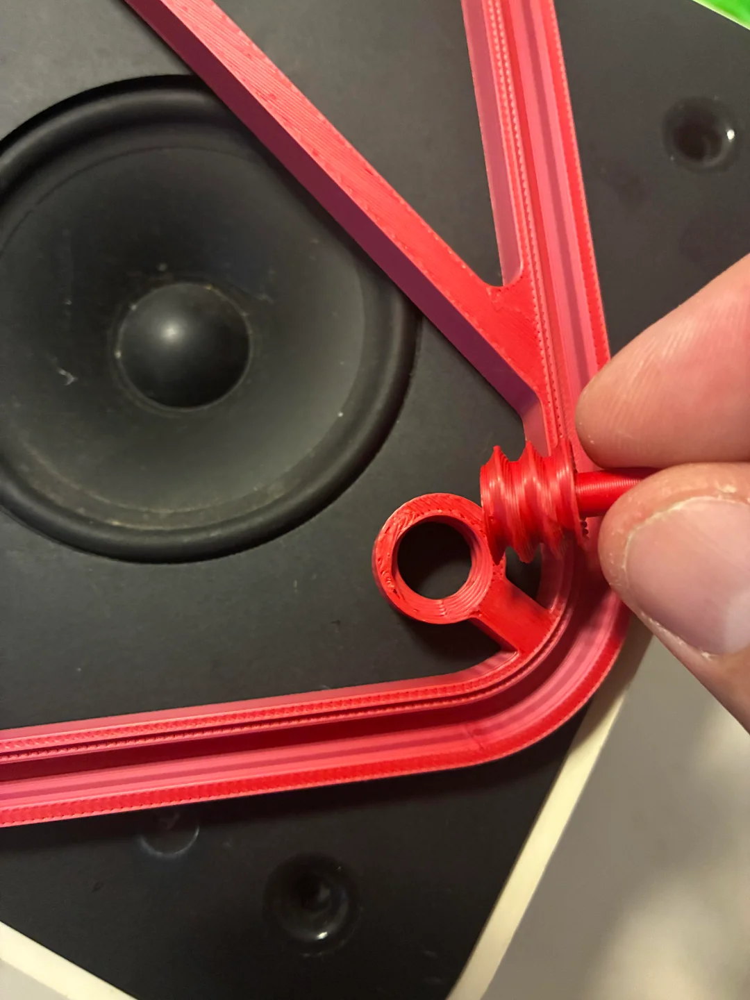

---

## Materials

Recommended:

- printed frame parts;
- acoustically transparent speaker cloth, or thin fabric for testing;
- glue for joining the printed frame sections;
- glue for the fabric retaining strips;
- optional adhesive for locking the pegs after final test fitting.

For the first successful prototype, very thin neoprene was used as a proof-of-concept fabric. It gave good coverage and worked well mechanically, but it should still be treated as a test material rather than a confirmed acoustically transparent speaker cloth.

For a final audio-focused build, proper speaker grille cloth is recommended.

Avoid thick upholstery fabric, felt, dense neoprene, metal mesh, mosquito screen, or any fabric that noticeably muffles the speakers.

---

## Print Settings

Prototype parts were printed with:

```text
Printer: Bambu Lab A1 Mini
Nozzle: 0.4 mm
Material: PLA
```

Suggested starting settings:

```text
Layer height: 0.16 mm or 0.20 mm
Walls: 3 or more
Infill: 15-25%
Supports: avoid if possible
Orientation: flat on the bed
```

PLA was used for prototyping and test fitting. PETG may be a good option for final parts if more toughness or heat resistance is desired.

Always test fit before gluing anything permanently.

---

## Assembly

Suggested assembly order:

1. Print the three main frame sections.
2. Print the replaceable mounting pegs.
3. Print the fabric retaining strips.
4. Print the optional assembly support.
5. Test fit the main frame sections on the iPod Hi-Fi fascia.
6. Test fit the pegs in the mounting holes.
7. Adjust or swap peg type if needed.
8. Use the assembly support to align the main frame sections.
9. Glue the main frame sections together.
10. Let the frame glue fully cure.
11. Stretch fabric over the frame.
12. Press the fabric into the retention channel.
13. Glue the retaining strips in place.
14. Trim the excess fabric after the glue has cured.
15. Install the grille on the iPod Hi-Fi.

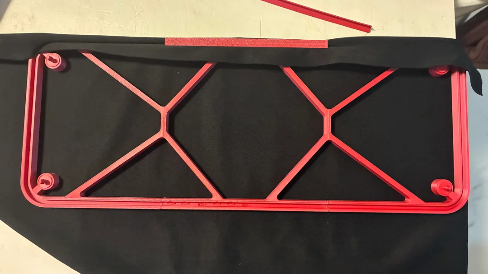

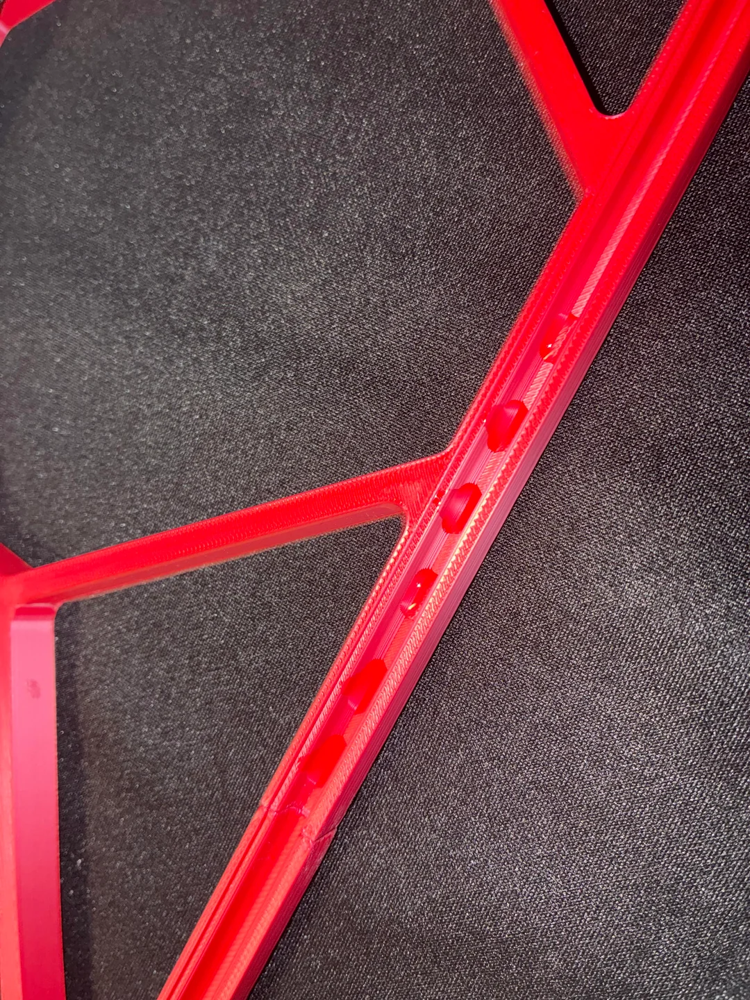

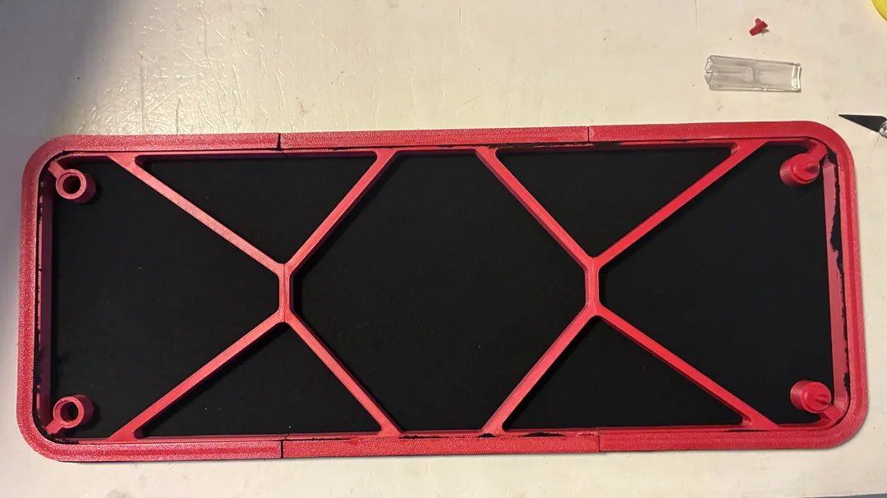

---

## Fabric Installation

The frame includes a fabric retention channel. The fabric is stretched over the frame, pressed into the channel, and held by glued retaining strips.

This is intended to make fabric installation cleaner and more repeatable than simply wrapping and gluing fabric around the back of the frame.

The retaining strips are not intended to be routinely removable. They are part of the final assembly.

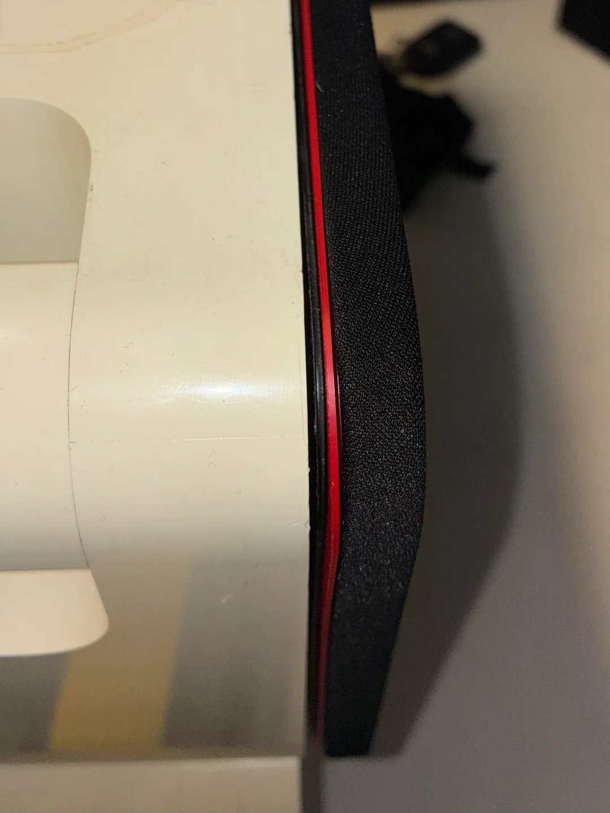

---

## Mounting Pegs

The mounting pegs are screw-in parts installed from the back of the grille frame.

Current thread specification:

```text
Thread diameter: 14 mm
Pitch: 3.5 mm
Profile: 60° trapezoidal
Tolerance class: 0.8 mm
```

The pegs can be installed before or after the fabric is mounted, since they do not interfere with the fabric or retaining strips.

If you do not plan to remove the pegs later, they can be glued in place after the final fit is confirmed.

### Mounting Hole Variation

A variation was found between two iPod Hi-Fi units.

On one unit, a 5 mm peg fit well. On another, the same peg would not go in. The fascia appears to have a small plastic retaining feature inside the mounting hole, probably intended to hold the original grille pegs in place.

Because of this, the design uses replaceable pegs.

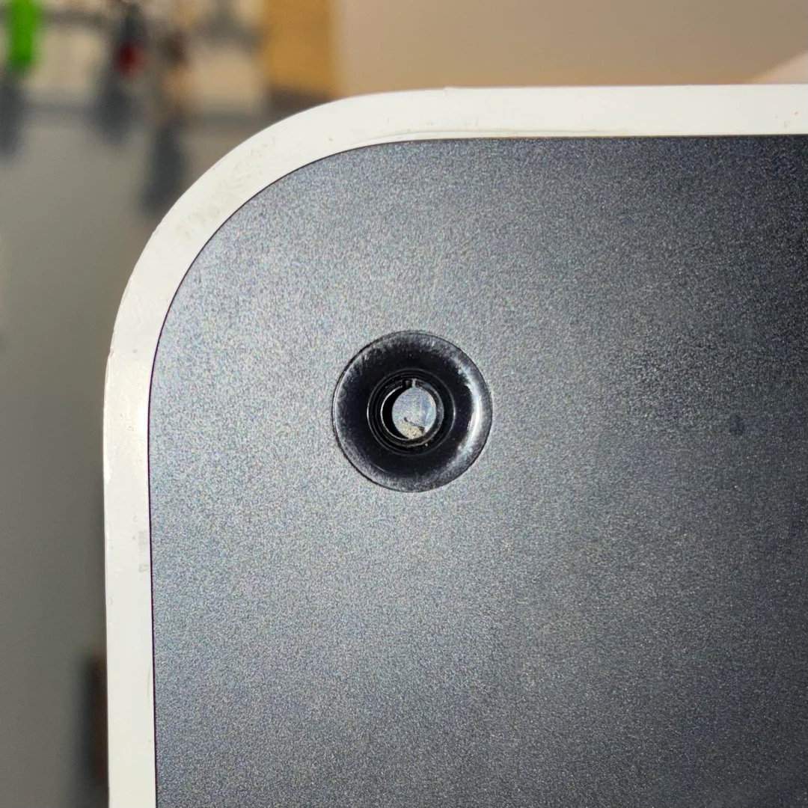

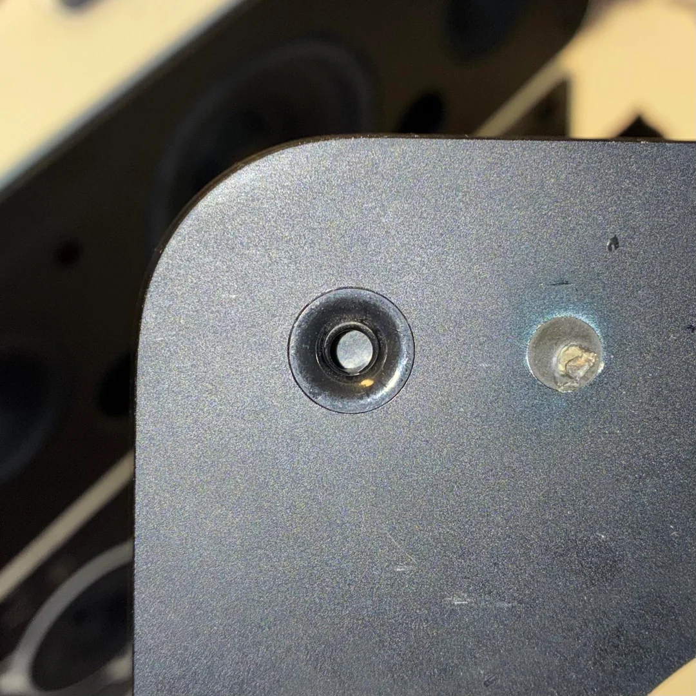

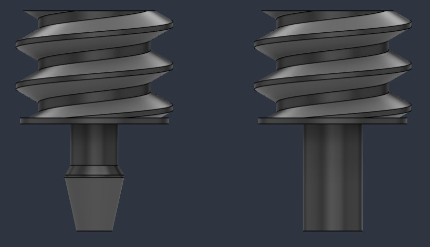

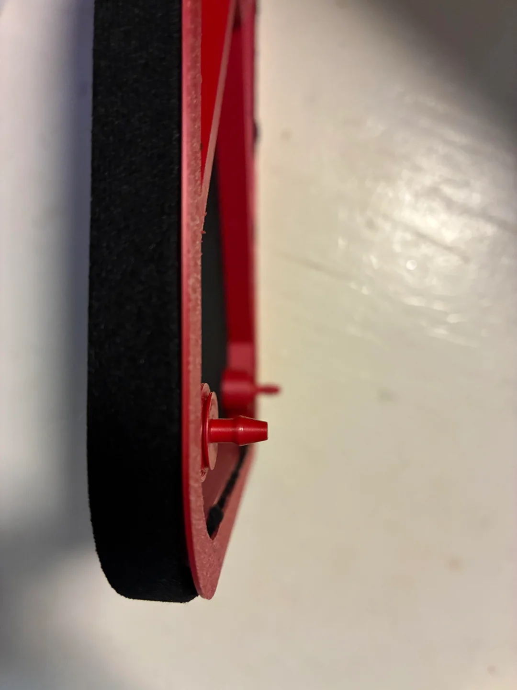

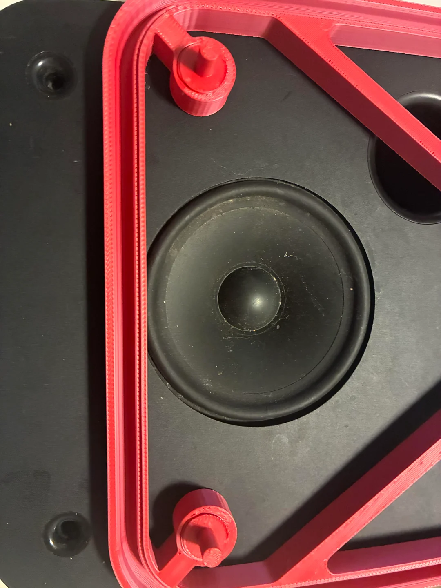

---

## Known Notes

- This is a replacement part, not an original Apple part.
- The fit was developed using real iPod Hi-Fi units, but small variation may exist between units.
- The mounting peg system is intentionally replaceable to make future improvements easier.
- The prototype fabric shown in some photos is very thin neoprene. It is useful for proving the assembly, but proper speaker grille cloth is still recommended for best acoustic transparency.
- Test fit everything before gluing.
- Do not force the pegs into the fascia. If the fit is too tight, change the peg design or adjust the print.

---

## Development Log

The design process, measurement approach, corner-radius tests, peg-spacing work, and thread decisions are documented separately in [`DEVELOPMENT.md`](DEVELOPMENT.md).

The README is kept focused on printing and assembly so people who only want to replicate the part do not need to read the full development history.

---

## Credits

This project was helped by the following public resources:

- [`jake-b/iPod-HiFi-Tweeters`](https://github.com/jake-b/iPod-HiFi-Tweeters), which documents iPod Hi-Fi disassembly, fascia work, and speaker mesh frame construction.
- [`BalzGuenat/CustomThreads`](https://github.com/BalzGuenat/CustomThreads), which provides Fusion 360 thread profiles designed for 3D-printed threads.
-  Reddit user `u/sparkyblaster`, for the helpful comment about the original rounded peg shape in the [Day 2 Reddit thread](https://www.reddit.com/r/ipod/comments/1v1avmh/day_2_of_trying_to_make_a_mesh_panel_for_my_ipod/).

---

## Disclaimer

Apple, iPod, and iPod Hi-Fi are trademarks of Apple Inc.

This project is independent and unofficial. It is not affiliated with, sponsored by, or endorsed by Apple.

The files and instructions are provided for repair, restoration, and educational purposes. Use them at your own risk.

Avoid adhesives or mounting methods that could permanently damage the speaker enclosure.

---

## License

Unless otherwise stated, documentation, images, and design files in this repository are shared under the Creative Commons Attribution-NonCommercial-ShareAlike 4.0 International License.

This means you may copy, modify, and share the work for non-commercial purposes, as long as you give credit and share adaptations under the same license.

If any third-party resources are included or adapted, their original licenses and attribution requirements must also be respected.
